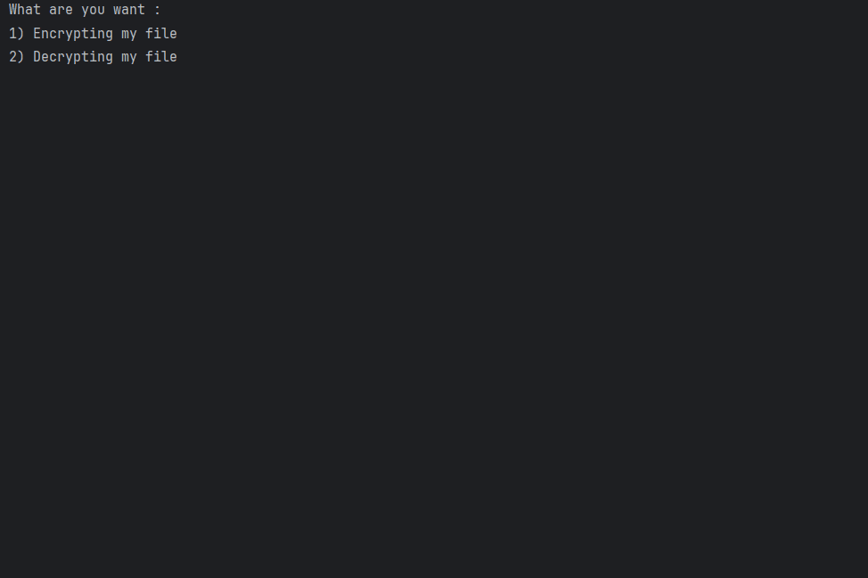

# AES Encrypting and decrypting algorithm
AES library [aes.c/.h] taken from (https://github.com/m3y54m/aes-in-c)

This project is extremely amateur.
You have to use password only 16 characters and for plaint text multiples of 113 characters

# For instance:

- Plain Text : 
That plain.txt has got main encrytion message and if you wantto lunch decryption message you have yo use this pr
ogram. First think is click 1 and use to url and restart program again now click 2 and use to url again and sho

- Key : 
thatismypassword

- Encrypted Text : 
m¨è
0WÇm”!1
ùÃÒä	…rU¡Þâ„C¬á͹8 5ßéOÙÏ¢¼Õè6ìñõ“ü¼«n…_"ÛCºK-eѰ쳦–¢X¼zä·
TâͳC¶Â6hV\T¡S
ÙÎ捱Q¦j4Dïfn[qË®göûº­ñ° ÄêUÆÓŠ‰Gñ²>ô+Ò×'qNímÙ…X¶>€%þ$§Ü	¶ÅÚÀ
ðYûmøI†sçþ/ûão,&@¥	/i Åü ÐÇ &¹« dd³jF`¥C+ʺãVj~Ð

- Decrypted Text : 
That plain.txt has got main encrytion message and if you wantto lunch decryption message you have yo use this pr
ogram. First think is click 1 and use to url and restart program again now click 2 and use to url again and sho

# A simple screen instance gif is below:
  
 
</a>
